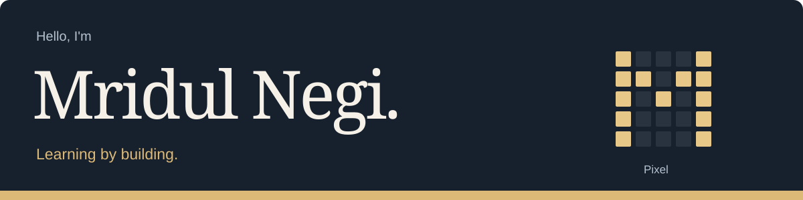
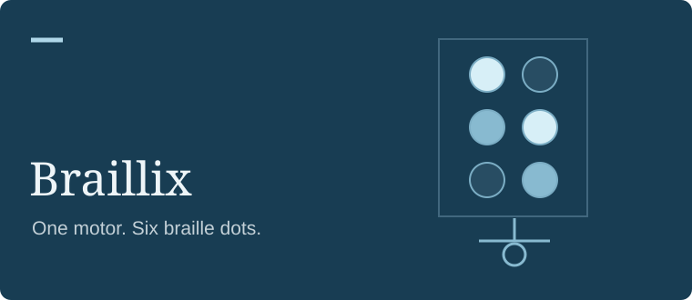
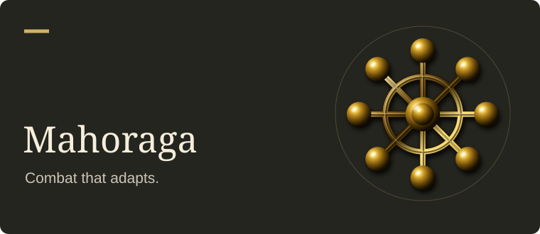
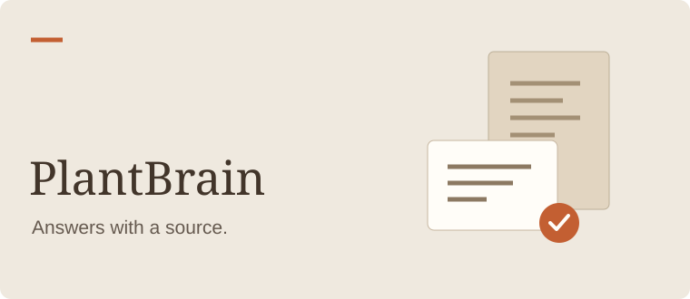

My projects range from adaptive agents to assistive hardware.

**[Website](https://mridulnegi.dev)** &nbsp; / &nbsp; **[LinkedIn](https://www.linkedin.com/in/mridulnegi/)**

### A few things I’ve worked on

<table>
<tr>
<td width="50%" valign="top">

A refreshable braille cell with a cam-driven mechanism. <b>Team capstone, in development.</b>

<a href="https://mridulnegi2005.github.io/Capstone/">Explore the 3D simulator</a> · <a href="https://github.com/MridulNegi2005/Capstone">Source</a>

</td>
<td width="50%" valign="top">

A combat environment for exploring adaptive agents. <b>Two-person project; national hackathon finalist.</b>

<a href="https://github.com/MridulNegi2005/Mahoraga">Explore the project</a>

</td>
</tr>
<tr>
<td width="50%" valign="top">

An industrial document assistant that connects answers to their sources. <b>Team hackathon project.</b>

<a href="https://github.com/MridulNegi2005/PlantBrain">Explore the project</a>

</td>
<td width="50%" valign="top">

A campus app for discovering events, chatting with friends, and coordinating carpools.

<a href="https://the-loop-5m7u.onrender.com/events">Browse events</a> · <a href="https://github.com/MridulNegi2005/The-Loop">Source</a>

</td>
</tr>
</table>

Team roles and project details are in the READMEs. I use AI tools while building.

### What I’m working toward

Building useful software, going deeper into Python and retrieval systems, and contributing to open source.

An earlier project: **[Cosmic Bot](https://github.com/MridulNegi2005/royalbot)**, a personal Discord bot.
